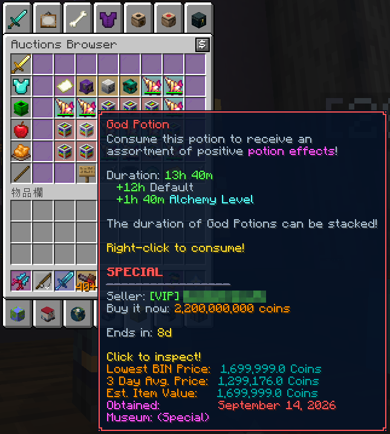
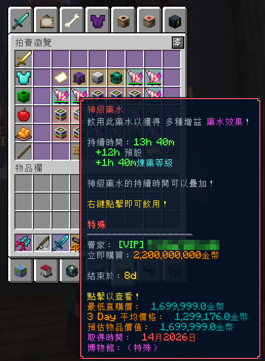
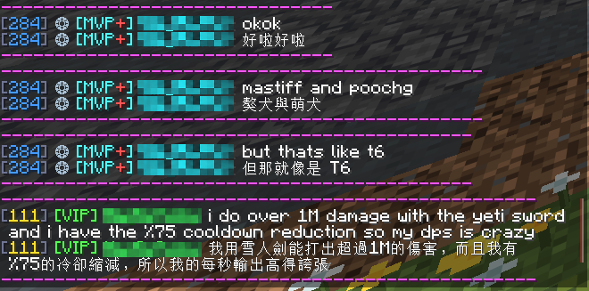
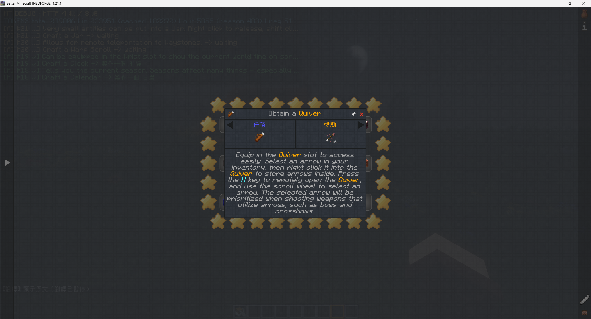
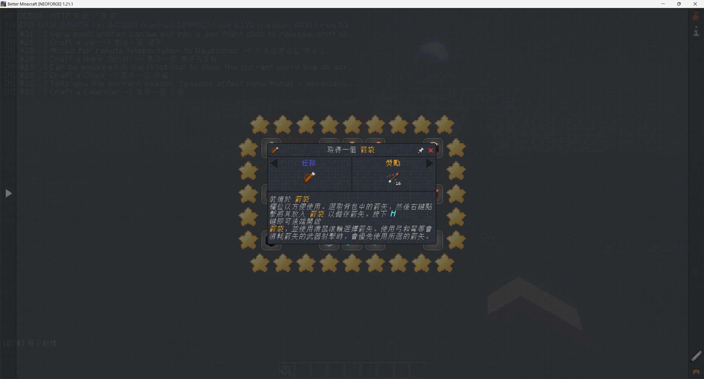
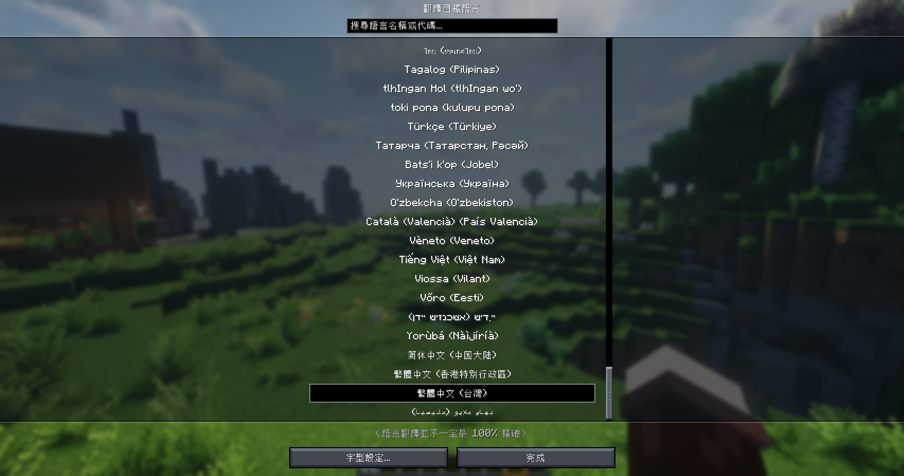

# Minecraft Translator 1.0.5

[English](README_EN.md)

Minecraft Translator 是純客戶端即時翻譯模組。它只翻譯畫面上需要翻譯的文字，不修改伺服器資料，也不會代替玩家送出聊天訊息。

## 主要功能

- 翻譯聊天、物品名稱、提示框、記分板、名牌、Boss Bar、標題、Action Bar、書本與模組介面。
- 每個顯示區域可選原文、譯文或原文＋譯文。
- 支援 Google、Youdao、DeepL、Microsoft 網頁翻譯與 OpenAI 相容 API。
- 所有支援版本都有 ChatGPT／Codex 登入、模型與推理強度選擇、工作階段 token 顯示；預設使用 `gpt-5.6-terra`／`medium`。
- 非同步批次、優先佇列、磁碟快取與失敗退避，避免畫面卡頓及重複請求。
- 玩家名只依 TAB 名單遮罩；物品名稱不再因 `with Chest` 等普通文字被誤判。
- 按 `P` 重新擷取目前介面的可見原文並重新翻譯，包含模組任務文字與正在顯示的提示框。
- 匯出／匯入翻譯 JSON，將朋友的翻譯合併到本機，保留自己已有的翻譯。

## 分享翻譯

在翻譯設定選擇「匯出翻譯」，把產生的 JSON 傳給朋友。朋友選擇相同目標語言與機器翻譯來源，再按「匯入翻譯」。匯入只補齊缺少的有效翻譯，不覆蓋已有內容，也不送出翻譯請求。檔案不包含 API Key、登入資料或模組設定。

Fabric 1.17.1 以上與 NeoForge 可互相分享；Fabric 1.14.4～1.16.5 與 Forge 1.12.2～1.13.2 可互相分享。這兩組的文字模板格式不同，不能跨組匯入。單一檔案上限為 32 MiB、10 萬筆翻譯。

舊版共用快取上限為 8,192 筆；合併後超過上限會拒絕整次匯入，避免擠掉原有翻譯。

## 實際遊戲展示

### Hypixel：物品提示與聊天翻譯

直接在伺服器內閱讀翻譯後的物品說明，保留文字顏色、數值與格式。下列圖片中的玩家名稱已打碼。

| 英文原文 | 繁體中文翻譯 |
| --- | --- |
|  |  |

聊天可以同時顯示原文與譯文，方便閱讀與對照。

### 模組包：任務說明翻譯

Better Minecraft 任務介面的實際翻譯前後，包含任務標題、長段落說明與彩色文字。點擊圖片可查看完整尺寸。

| 英文原文 | 繁體中文翻譯 |
| --- | --- |
|  |  |

多種翻譯目標語言，選擇自己熟悉的語言

## 直接下載

每個 JAR 只支援檔名標示的 Minecraft 版本與 Loader，不可混用。

[下載包含全部版本與分類資料夾的 ZIP](https://github.com/DragonMeow1012/MinecraftTranslator/releases/download/v1.0.5/MinecraftTranslator-1.0.5-all-versions.zip)

### Fabric

Fabric 版本需要相符版本的 Fabric Loader 與 Fabric API。

| Minecraft | Java | 下載 |
| --- | ---: | --- |
| 1.14.4 | 8 | [mctranslator-1.0.5-Fabric-1.14.4.jar](https://github.com/DragonMeow1012/MinecraftTranslator/releases/download/v1.0.5/mctranslator-1.0.5-Fabric-1.14.4.jar) |
| 1.15.2 | 8 | [mctranslator-1.0.5-Fabric-1.15.2.jar](https://github.com/DragonMeow1012/MinecraftTranslator/releases/download/v1.0.5/mctranslator-1.0.5-Fabric-1.15.2.jar) |
| 1.16.5 | 8 | [mctranslator-1.0.5-Fabric-1.16.5.jar](https://github.com/DragonMeow1012/MinecraftTranslator/releases/download/v1.0.5/mctranslator-1.0.5-Fabric-1.16.5.jar) |
| 1.17.1 | 16 | [mctranslator-1.0.5-Fabric-1.17.1.jar](https://github.com/DragonMeow1012/MinecraftTranslator/releases/download/v1.0.5/mctranslator-1.0.5-Fabric-1.17.1.jar) |
| 1.18.2 | 17 | [mctranslator-1.0.5-Fabric-1.18.2.jar](https://github.com/DragonMeow1012/MinecraftTranslator/releases/download/v1.0.5/mctranslator-1.0.5-Fabric-1.18.2.jar) |
| 1.19.4 | 17 | [mctranslator-1.0.5-Fabric-1.19.4.jar](https://github.com/DragonMeow1012/MinecraftTranslator/releases/download/v1.0.5/mctranslator-1.0.5-Fabric-1.19.4.jar) |
| 1.20.1 | 17 | [mctranslator-1.0.5-Fabric-1.20.1.jar](https://github.com/DragonMeow1012/MinecraftTranslator/releases/download/v1.0.5/mctranslator-1.0.5-Fabric-1.20.1.jar) |
| 1.21.1 | 21 | [mctranslator-1.0.5-Fabric-1.21.1.jar](https://github.com/DragonMeow1012/MinecraftTranslator/releases/download/v1.0.5/mctranslator-1.0.5-Fabric-1.21.1.jar) |
| 1.21.11 | 21 | [mctranslator-1.0.5-Fabric-1.21.11.jar](https://github.com/DragonMeow1012/MinecraftTranslator/releases/download/v1.0.5/mctranslator-1.0.5-Fabric-1.21.11.jar) |
| 26.1.2 | 25 | [mctranslator-1.0.5-Fabric-26.1.2.jar](https://github.com/DragonMeow1012/MinecraftTranslator/releases/download/v1.0.5/mctranslator-1.0.5-Fabric-26.1.2.jar) |
| 26.2 | 25 | [mctranslator-1.0.5-Fabric-26.2.jar](https://github.com/DragonMeow1012/MinecraftTranslator/releases/download/v1.0.5/mctranslator-1.0.5-Fabric-26.2.jar) |
| 26.3 | 25 | [mctranslator-1.0.5-Fabric-26.3.jar](https://github.com/DragonMeow1012/MinecraftTranslator/releases/download/v1.0.5/mctranslator-1.0.5-Fabric-26.3.jar) |

### NeoForge

| Minecraft | Java | 下載 |
| --- | ---: | --- |
| 1.20.1 | 17 | [mctranslator-1.0.5-NeoForge-1.20.1.jar](https://github.com/DragonMeow1012/MinecraftTranslator/releases/download/v1.0.5/mctranslator-1.0.5-NeoForge-1.20.1.jar) |
| 1.21.1 | 21 | [mctranslator-1.0.5-NeoForge-1.21.1.jar](https://github.com/DragonMeow1012/MinecraftTranslator/releases/download/v1.0.5/mctranslator-1.0.5-NeoForge-1.21.1.jar) |
| 26.2 | 25 | [mctranslator-1.0.5-NeoForge-26.2.jar](https://github.com/DragonMeow1012/MinecraftTranslator/releases/download/v1.0.5/mctranslator-1.0.5-NeoForge-26.2.jar) |
| 26.3 | 25 | [mctranslator-1.0.5-NeoForge-26.3.jar](https://github.com/DragonMeow1012/MinecraftTranslator/releases/download/v1.0.5/mctranslator-1.0.5-NeoForge-26.3.jar) |

### Forge

| Minecraft | Java | 下載 |
| --- | ---: | --- |
| 1.12.2 | 8 | [mctranslator-1.0.5-Forge-1.12.2.jar](https://github.com/DragonMeow1012/MinecraftTranslator/releases/download/v1.0.5/mctranslator-1.0.5-Forge-1.12.2.jar) |
| 1.13.2 | 8 | [mctranslator-1.0.5-Forge-1.13.2.jar](https://github.com/DragonMeow1012/MinecraftTranslator/releases/download/v1.0.5/mctranslator-1.0.5-Forge-1.13.2.jar) |

## 安裝

1. 從上表下載完全相符的 JAR。
2. 安裝相同 Minecraft 版本的 Fabric、NeoForge 或 Forge。
3. 將 JAR 放入該遊戲實例的 `mods` 資料夾。
4. 使用表格標示的 Java 版本啟動遊戲。

## 翻譯來源

| 來源 | API Key | 說明 |
| --- | --- | --- |
| Google | 不需要 | 預設機器翻譯來源。 |
| Youdao／DeepL／Microsoft | 不需要 | 實驗性網頁介面，可能受限流或網站改版影響。 |
| OpenAI 相容 API | 視服務而定 | 可設定 Base URL、模型、API Key、詞彙表與 GT 回退。 |
| ChatGPT／Codex | 使用 ChatGPT 登入 | 所有表列版本均支援；需先安裝 Codex CLI，可選模型、推理強度並查看 token。 |

## 快捷鍵

Fabric 1.17.1 以上與 NeoForge：

| 按鍵 | 功能 |
| --- | --- |
| `G` | 切換原文／譯文顯示 |
| `R` | 重新翻譯游標指向的物品 |
| `P` | 重新翻譯目前介面的可見文字與提示框 |
| 未綁定 | 開啟翻譯設定 |

舊版介面：

| 版本 | 按鍵 |
| --- | --- |
| Fabric 1.14.4～1.16.5 | `G` 開啟翻譯設定；`P` 重新翻譯目前介面 |
| Forge 1.12.2～1.13.2 | `G` 開啟翻譯設定；`H` 啟用／停用翻譯；`P` 重新翻譯目前介面 |

`P` 擷取當下可見的文字，不包含尚未捲動到的內容；輸入文字時不會觸發。重新翻譯完成時間取決於所選翻譯服務。

## 1.0.5 重點

- `P` 重新翻譯目前介面的可見文字，包含模組任務段落與正在顯示的提示框。
- 新增翻譯檔匯出／匯入，分享既有譯文並保留本機已有內容。
- 減少現代版本每幀重複驗證記憶體快取的負擔；長時間卡頓改善仍需實機複測。
- 本次發布包含全部 18 個 Minecraft／Loader 目標，26.3 已整合進全版本 ZIP。

## 1.0.4 重點

- 修正長時間遊玩後開啟背包／容器時 CPU、記憶體與磁碟讀寫暴增：現代版快取改用有上限的追加式日誌，不再因單筆物品翻譯就在主執行緒排序並重寫整份快取。
- 背包、容器、快捷欄與副手改為 350 ms 間隔的差異掃描；舊版也改用不註冊 callback 的預取，避免每 tick 重送全部格子及累積等待者。
- 為翻譯佇列、執行器、同時請求、callback、重試、Codex 狀態及記憶體快取加上界限與完成後清理，避免使用時間越久資源占用越高。
- 快取命中走快速路徑，失敗重試改為按需掃描，並減少玩家名遮罩、正規表示式與翻譯上下文的重複配置；現代版 HTTP 原始回應限制為 4 MiB，舊版亦保留串流字元上限。
- 同一套修復已移植至歷來 Release 提供的全部 16 個 Minecraft／Loader 目標，並逐一建置與成品回歸驗證。

## 1.0.3 重點

- 以 1.0.2 穩定架構為基礎，保留原本翻譯流程。
- 新增 ChatGPT／Codex 登入、模型選擇與 token 顯示。
- Codex 翻譯停用不需要的工具與摘要、取消額外等待並使用可用的 priority tier，縮短回應時間。
- 玩家名遮罩只讀 TAB 名單；移除文字模板與快取中的玩家名猜測。
- 修正 `Bloom Boat with Chest` 被送成 `Bloom Boat with {值}` 的問題。

## 隱私

- 只將需要翻譯的文字送到所選來源。
- API Key 儲存在本機 Minecraft 設定資料夾。
- TAB 名單中的玩家名會先在本機遮罩；其他伺服器文字仍可能包含使用者提供的內容。
- 回報問題前請遮住 API Key、Authorization header 與私人伺服器資訊。

## 原始碼與回報

各版本建置方式與 Release 資料夾結構請見 [PACKAGING.md](PACKAGING.md)。問題請提交到 [GitHub Issues](https://github.com/DragonMeow1012/MinecraftTranslator/issues)。
